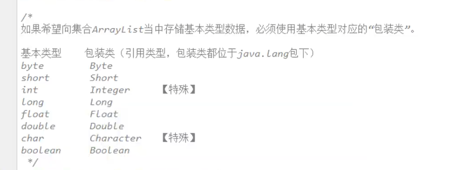

# Java  ArrayList数组列表

1. 数组的长度不可改变，但ArrayList数组列表（list集合）的长度可以通过add和remove方法任意改变。

2. 对于ArrayList，有一个尖括号<E>代表泛型。

   泛型：指装在集合当中的所有元素必须是统一的引用类型。（==注意：泛型只能是引用类型，不能是基本类型==）

3. ArrayList中存储基本数据类型需要进行装箱。

   

   

