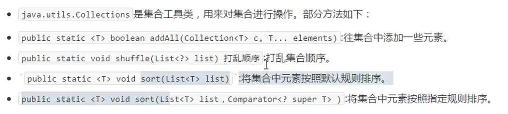

# Java Collections集合工具类

> 常用方法：

	

## 1.addAll方法

```java
public static <T> boolean addAll(Collection<? super T> c, T... elements)
```

```java
    public static void main(String[] args) {
        ArrayList<String> list = new ArrayList<>();
        list.add("A-");
        //向一个集合中添加多个同一类型或其子类的数据元素
        Collections.addAll(list,"A,","B","C","D");
        System.out.println(list);//[A-, A,, B, C, D]
    }
```

## 2.shuffle方法

```java
public static void shuffle(List<?> list)
```

```java
public static void main(String[] args) {
    ArrayList<String> list = new ArrayList<>();
    list.add("A-");
    //向一个集合中添加多个同一类型的数据元素
    Collections.addAll(list,"A,","B","C","D");
    System.out.println(list);//[A-, A,, B, C, D]
    //随机打乱List集合顺序
    Collections.shuffle(list);
    System.out.println(list);//[B, C, D, A,, A-] 随机结果
}
```

## 3.sort方法

```java
public static <T extends Comparable<? super T>> void sort(List<T> list)
```

```java
public static void main(String[] args) {
    ArrayList<Integer> integers = new ArrayList<>();
    Collections.addAll(integers,2,3,1,5,4);
    System.out.println(integers);//[2, 3, 1, 5, 4]
    //将集合中的元素按照默认规则排序（升序）
    Collections.sort(integers);
    System.out.println(integers);//[1, 2, 3, 4, 5]
}
```

> 注意：如果需要使用sort( )方法排列自定义类型集合，该自定义类需要实现Comparable<T>接口，实现其compareTo( )方法。

## 4.sort方法自定义类型排序

> 1.通过自定义类型实现Comparable<T>接口的方式实现sort排序

```java
public class Person implements Comparable<Person>{
    private String name;
    private int age;
    
        @Override
    public int compareTo(Person o) {
        /*
        自己(this)-参数 -->  升序
        参数-自己(this) -->  降序
         */
        return this.age - o.getAge();
    }
}
```

```java
    public static void main(String[] args) {
        //public static <T extends Comparable<? super T>> void sort(List<T> list)
        //通过自定义类型实现Comparable<T>接口的方式实现sort排序
        Person person1 = new Person("LYX",23);
        Person person2 = new Person("CXY",22);
        Person person3 = new Person("XXX",99);
        ArrayList<Person> list = new ArrayList<>();
        Collections.addAll(list,person1,person2,person3);
        System.out.println(list);//[Person{name='LYX', age=23}, Person{name='CXY', age=22}, Person{name='XXX', age=99}]
        Collections.sort(list);
        System.out.println(list);//[Person{name='CXY', age=22}, Person{name='LYX', age=23}, Person{name='XXX', age=99}]
    }
```

> 2.类不必实现Comparable<T>接口，直接通过传入Comparator<T>比较器的方式实现sort排序

```java
    public static void main(String[] args) {
        //public static <T> void sort(List<T> list, Comparator<? super T> c)
        //通过传入Comparator<T>比较器的方式实现sort排序
        Animal animal1 = new Animal("猫",3);
        Animal animal2 = new Animal("狗",1);
        Animal animal3 = new Animal("熊",23);
        ArrayList<Animal> animals = new ArrayList<>();
        Collections.addAll(animals,animal1,animal2,animal3);
        System.out.println(animals);//[Animal{name='猫', age=3}, Animal{name='狗', age=1}, Animal{name='熊', age=23}]
        //通过匿名内部类的方式实现Comparator<T>，创建比较器按照指定规则排序
        Collections.sort(animals, new Comparator<Animal>() {
            @Override
            public int compare(Animal o1, Animal o2) {
                /*
                o1-o2 --> 升序
                o2-o1 --> 降序
                 */
                return o1.getAge()-o2.getAge();
            }
        });
        System.out.println(animals);//[Animal{name='狗', age=1}, Animal{name='猫', age=3}, Animal{name='熊', age=23}]
    }
```

> 3.实现compare方法的多重排序规则

```java
Collections.sort(animals, new Comparator<Animal>() {
    @Override
    public int compare(Animal o1, Animal o2) {
        //多重排序
        int result = o1.getAge() - o2.getAge();
        //如果年龄相同，则毕竟名称首字母
        if (result==0){
            return o1.getName().charAt(0)-o2.getName().charAt(0);
        }else {
            return result;
        }
    }
});
```