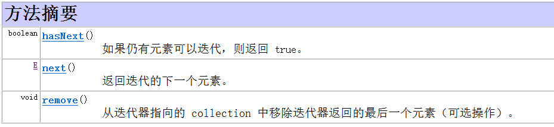
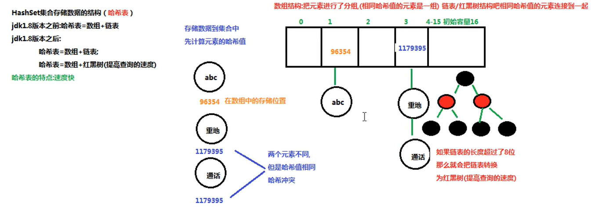

# Java Collection集合

## 一、集合概述

1.集合时java中提供的一种容器，可以用来存储多个数据。

2.集合和数组的区别：

- 数组的长度是固定的，而集合的长度是可变的。
- 数组中存储的是同一类型元素，既可以是基本类型元素也可以是引用对象元素。而集合中存储的都是==统一类型的引用对象元素==。

## 二、集合的架构


## 三、集合的区别与接口公共方法


	

## 四、Iterator迭代器

1.作用：对 collection 进行迭 代的迭代器。（对集合进行遍历）

2.方法：

	

3.获取对象：

collection接口中有一个方法iterator( ),此方法用于返回的就是Iterator迭代器的实现对象。

```java
        //获取Iterator<T>迭代器
        Iterator<String> iteratorStr = strings.iterator();
        //使用迭代器遍历输出集合
        while (iteratorStr.hasNext()){
            System.out.println(iteratorStr.next());
        }
```

## 五、Collection子类——List集合

### 1.List集合特点：

- List是有序集合，即存取顺序一致。
- ==List具有索引==。
- ==List集合允许存储重复元素==。

### 2.List实现类——ArrayList集合

- ArrayList采用数组结构储存，元素查询快，增删慢。

### 3.List实现类——LinkedList集合

- LinkedList采用链式存储结构，元素增删快，查询慢。
- 包含了多种操作头和尾的方法。

### 4.List实现类——Vector集合（了解）

## 六、Collection子类——Set集合

### 1.Set集合特点

- ==不允许存储重复的元素==。
- ==没有索引==。

### 2.Set集合重复判断的具体实现

> Set集合在调用add方法时，add方法会先调用hashcode( )再调用equals( )方法去判断元素是否重复。
>
> （也因此两个方法常常需要同时重写，以改由对象成员变量决定是否重复，而非单纯比较对象的地址值）
>
> 

### 3.Set实现类——HashSet集合

- HashSet是一个==无序集合==。
- 底层是哈希表结构。（查询速度快）
- HashSet集合的数据结构：

> 数组存储哈希值，在一个数组存储单元下链接了多个同一哈希值（哈希冲突）的对象元素。

### 	4.Set实现类——LinkedHashSet集合

- 底层同HashSet，但多了一条链表用于记录元素的存储结构，以保证元素有序。

## 七、补充：哈希值

- 哈希值是一个十进制的整数，由系统随机给出（就是对象的地址值，但是一个逻辑地址，是模拟出来的地址，不是实际的物理地址）。
- 获取对象哈希值的方法：int  hashcode( )
- ==哈希值相同，两对象不一定相同；哈希值不同，两对象一定不同。==

