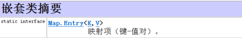
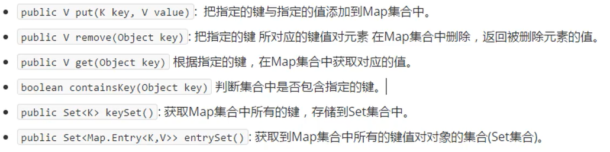
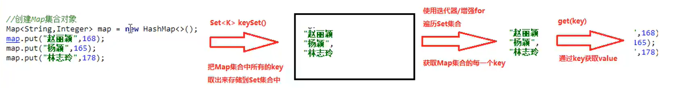
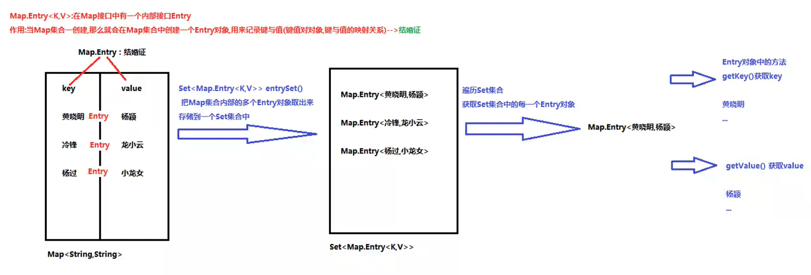

# Java Map<k,v>集合

## 一、介绍

1. Map<k,v>集合是一个双列集合,一个元素保护两个值（key和value）。

2. Map<k,v>集合中的元素，key和value的数据类型可以相同也可以不同。

3. Map<k,v>集合中的元素，key不允许重复。

4. Map<k,v>集合中的元素，key和value一一对应，一个key只能取出它相对应的value。

5. Map<k,v>集合中常用的实现类：`HashMap`和`LinkedHashMap`。

6. Map类中有一个嵌套内部类Entry类，该类为key-value映射键值对关系的类。

   	
   
7. 注意：Map集合需要保证key键唯一，因此==作为key键的元素必须重新hashCode方法和equals方法！==

## 二、Map<k,v>集合的常用方法

	


> **通过KeySet( )方法实现Map<k,v>集合的遍历**

<span style="color:red">通过KeySet( )方法获取Key键的Set集合，通过对Set集合的遍历实现对Map<k,v>集合的遍历。</span>



```java
//Set集合构造器
Iterator<String> iterator = hashMap.keySet().iterator();
while (iterator.hasNext()){
    String key = iterator.next();
    Integer value = hashMap.get(key);
    System.out.println(key+":"+value);
}
```


> **通过entrySet( )方法实现Map<k,v>集合的遍历**


<span style="color:red">通过entrySet( )方法获得Map.Entry类的Set集合，通过对Set集合的遍历实现对Map<k,v>集合的遍历。</span>

		

```java
Set<Map.Entry<String, Integer>> entrySet = hashMap.entrySet();
Iterator<Map.Entry<String, Integer>> entryIterator = entrySet.iterator();
while (entryIterator.hasNext()){
    Map.Entry<String, Integer> entry = entryIterator.next();
    String key = entry.getKey();
    Integer value = entry.getValue();
    System.out.println(key+":"+value);
}
```

## 三、HashMap

1. 特点：
   - HashMap集合的底层是哈希表结构，查询速度快。
   - HashMap集合是一个无序集合，存储元素和取出元素的顺序可能不一致。

## 四、LinkedHashMap

1. 特点：
   - LinkedHashMap集合的底层是哈希表+链表结构，链表保证了迭代的顺序。
   - LinkedHashMap集合是一个有序的集合，存储元素和取出元素的顺序一致。
   - LinkedHashMap集合继承于HashMap集合。

## 五、Hashtable

1. 特点
   - 键值对key和value不允许为Null。
   - 线程安全，是单线程集合，速度慢。
   - 通常使用其子类Properties集合，该集合是唯一和io流相结合的集合。