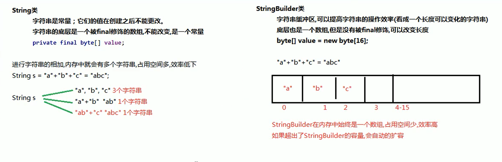

# Java StringBuilder字符串缓冲区

## 一、原理与作用



## 二、对象与常用方法

### 1.创建StringBuilder对象：

```java
        StringBuilder builder1 = new StringBuilder();
        StringBuilder builder2 = new StringBuilder("TEST");
```

### 2.StringBuilder方法

2.1append( ) 追加任意类型数据的字符串形式，并返回当前对象自身。

```java
builder2.append("追加");
```

2.2toString( )将当前StringBuilder对象转为String对象。

```java
//String -> StringBuilder
StringBuilder builder2 = new StringBuilder("TEST");
//StringBuilder -> String
String builderStr = builder2.toString();
```