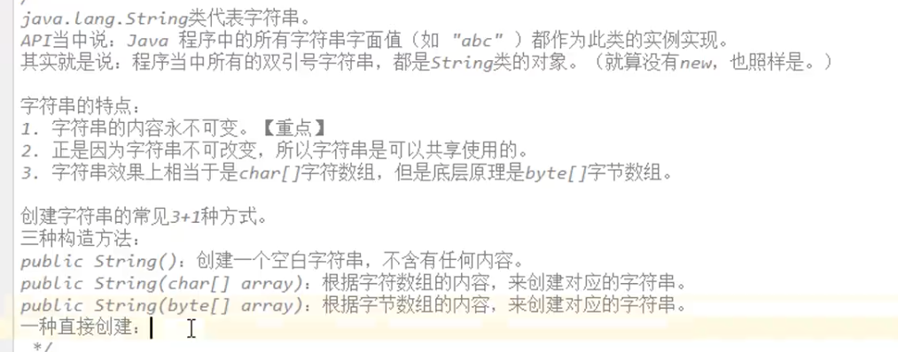
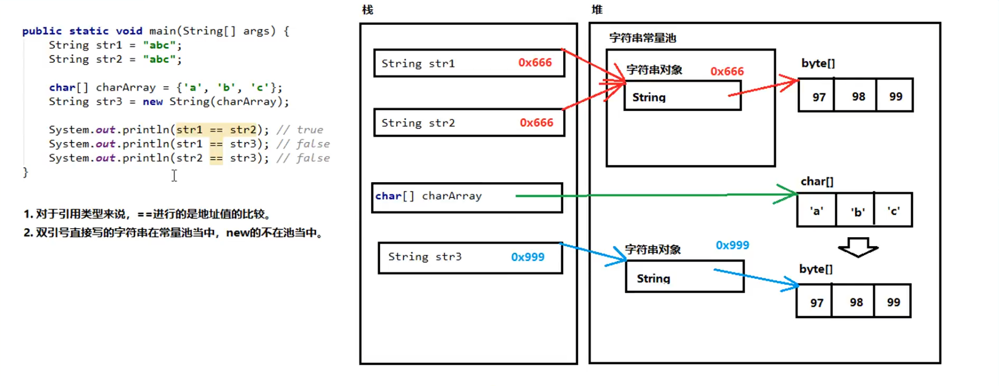
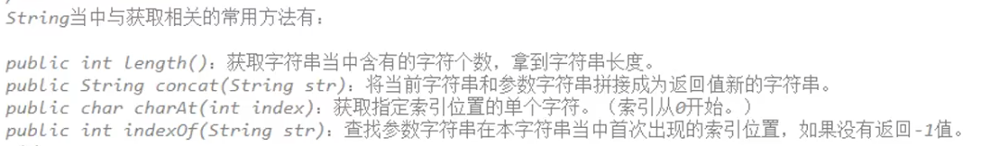
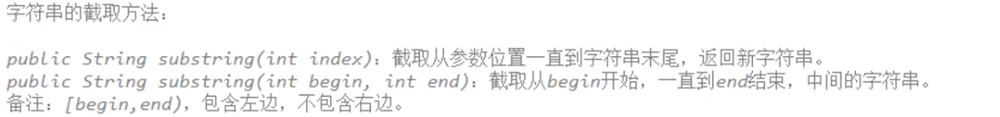
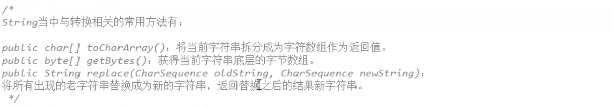
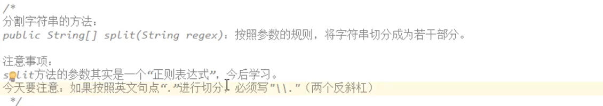

# Java String详解

1. ###### 字符串的创建

   

2. ###### 字符串常量池：String字符串指向堆中常量池里的字符串对象，而常量池中字符串对象存储的是堆中的byte字节数组的地址。（字符串底层均以byte字节数组的形式存储）

   

3. ###### 字符串的比较：

   1. ==基本类型比较数值，引用类型比较地址值。
   2. equals(Object obj)  当参数是字符串且内容相同时返回true，否则返回false。
   3. equalsIgnoreCase(String str) 忽略大小写比较两字符串。 

4. ###### 字符串的常用方法

   

   

   

   

   