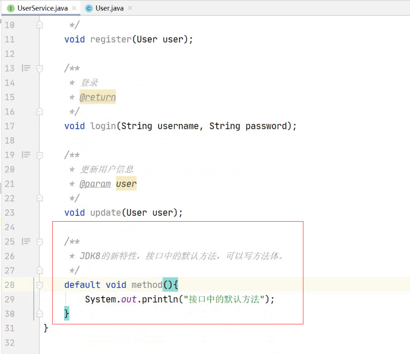
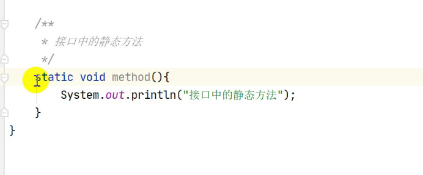

# Java abstract抽象和interface接口

## 一、abstract抽象

1. 拥有抽象方法的类，一定为抽象类；相反，抽象类不一定有抽象方法。
2. ==抽象类未实现全部抽象方法则不能直接实例化，因此抽象类一定有子类。==
3. ==抽象类也拥有构造方法，用于为子类继承的初始化==，==抽象类可以理解为有方法待实现的普通类。==

## 二、interface接口

1. 接口中所有的方法均为抽象方法，且默认抽象方法为public abstract（可省略不写）。

2. JDK8新特性：interface接口中可以有default默认方法（已实现的具体方法），优势在于后期添加新需求时修改接口不必更新所有实现类，只需在接口中更新添加默认方法即可。

   

3. JDK8新特性：接口中的静态方法，可通过接口名直接调用，且==接口中的静态方法不能被继承==。

   

4. ==interface接口不能有构造方法==，因为==接口中的成员变量均默认为静态常量==（static final）

5. **由普通的类来实现接口，必须将接口所有抽象方法重写**

   **由抽象类来实现接口，则不必重写接口的方法。可以全部不重写或只重写一部分方法。**

6. ==一个子实现类可以implements实现多个接口，一个子接口可以extends继承多个父接口。==

