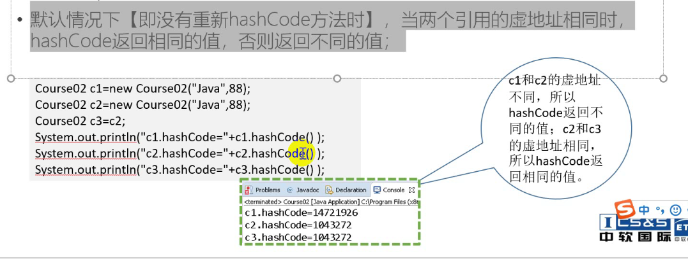
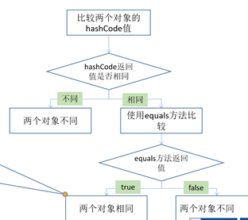
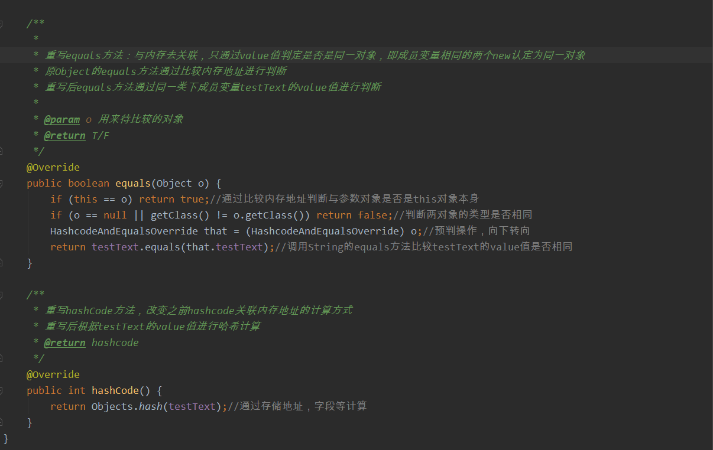

# Java hashcode哈西码

1. Object类中定义了hashCode方法【 public int hashCode() 】，==用来返回对象的哈希码==。Java中的hashCode方法就是根据一定的规则将与对象相关的信息（比如==对象的实际存储地址，对象的字段等==）映射成一个数值，这个数值称作为散列值。

2. 默认情况下【即没有重新hashCode方法时】，==当两个引用的虚地址相同时，hashCode返回的值相同，否则返回的值不同==；

3. 如果两个对象的hashcode值不同，则对象一定不相同，如果hashcode值相同，则对象不一定相同。

4. 基于哈希的集合在使用hashCode的时候，基本都是和equals一起使用

   考虑一种情况，当向集合中插入对象时，如何判别在集合中是否已经存在该对象了？（注意：集合中不允许重复的元素存在）

   　　也许大多数人都会想到调用equals方法来逐个进行比较，这个方法确实可行。但是如果集合中已经存在一万条数据或者更多的数据，如果采用equals方法去逐一比较，效率必然是一个问题。此时hashCode方法的作用就体现出来了，当集合要添加新的对象时，先调用这个对象的hashCode方法，得到对应的hashcode值，实际上在HashMap的具体实现中会用一个table保存已经存进去的对象的hashcode值，如果table中没有该hashcode值，它就可以直接存进去，不用再进行任何比较了；如果存在该hashcode值， 就调用它的equals方法（比较内存地址是否相同）与新元素进行比较，相同的话就不存了，不相同就散列其它的地址。

   

