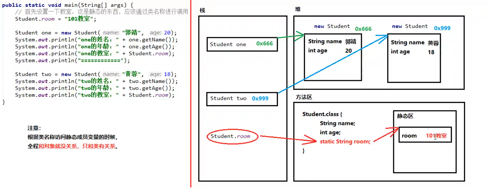

# static关键字

static：静态的。变量，方法，内部类

static的特点：

1） 静态是随着类的出现而出现，随着类的消失而消失

2） 静态优先于对象而存在

3） 静态可以被类的所有对象共享

4） 静态可以通过类名直接调用，也可以通过对象调用

注意：

1） 静态只能调用静态，不能调用非静态：出现的先后顺序，静态先出现，非静态在对象创建以后才出现，先出现的东西不能调用还不存在的东西。

2） 非静态既可以调用静态，也可以调用非静态

3） 静态中不能出现this关键字

