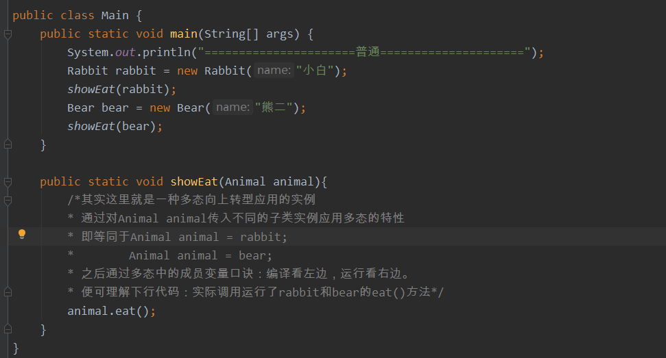

# Java 多态

1. 什么是多态？Fu obj = new Son();

   向上转型后 ==只能编译调用Fu中有的成员变量喝成员方法==

2. 多态中的成员方法：==编译看左边，运行也看左边==。

   obj.a；先编译 根据Fu中是否有a成员变量，再运行 取等号左边Fu的成员变量a的值，没有再向上查找（向Fu的父类查找成员变量a）。

3. 多态中的成员变量：==编译看左边，运行看右边==。

   obj.method()； 先编译 根据Fu中是否有method()方法决定，再运行 右边new谁执行谁的方法，没有再向上查找（向Son的父类查找method()方法）。

