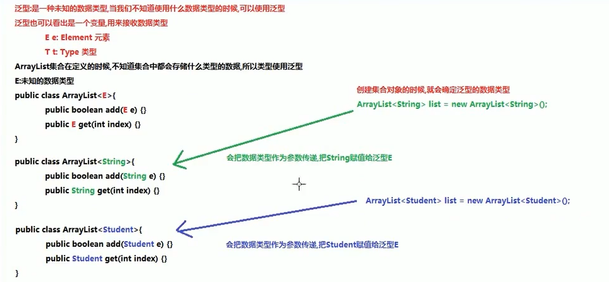
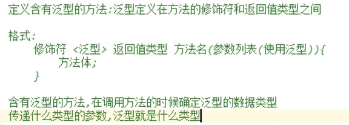

# Java 泛型

### 一、介绍

可以理解为在定义时期声明一种未知类型，并在后期使用中可以确定。



## 二、泛型的优劣

### 1.不使用泛型

- 好处：当集合不使用泛型时，默认存储的类型是object类型，可以存储任意类型的数据。
- 弊端：不安全，当从集合中取出数据时也是object类型，在使用中会产生类型转换上的问题与异常。

### 2.使用泛型

- 好处：避免了类型转换时所产生的问题与异常，存储与取出的类型一致。
- 弊端：只能存储单一的数据类型。

## 三、泛型的使用

### 1.类中的使用

```java
/**
 * 自定义泛型类
 */
public class GenericityClass<T> {
    private T t;

    public T getT() {
        return t;
    }

    public void setT(T t) {
        this.t = t;
    }
}
```

### 2.方法中的使用 

	

```java
    public <M> void GenericityMethod(M m){
        System.out.println(m.getClass()+":"+m);
    }
```

```java
        genericityClass.GenericityMethod(1);//class java.lang.Integer:1
        genericityClass.GenericityMethod(1.1);//class java.lang.Double:1.1
        genericityClass.GenericityMethod("A");//class java.lang.String:A
        genericityClass.GenericityMethod('A');//class java.lang.Character:A
```

### 3.接口中的使用

- 实现类保留接口的泛型类型，在实现类对象被创建时再声明泛型类型。

  ```java
  public class GenericityImp1<I> implements GenericityInterFace<I> {
      @Override
      public void method1(I i) {
          System.out.println(i);
      }
  }
  ```

- 实现类为接口声明泛型类型，在接口的抽象方法中使用的泛型类型也随之被声明为该类型。

  ```java
  public class GenericityImp2 implements GenericityInterFace<String> {
      @Override
      public void method1(String s) {
          System.out.println(s);
      }
  }
  ```

## 四、泛型的通配符<?>

==<?>代表参数列表中含有泛型的参数类型中未声明类型的泛型==，如下例中的<?>则可以代表任意引用数据类型。

```java
public static void printMethod(ArrayList<?> arrayList){
    Iterator<?> iterator = arrayList.iterator();
    while (iterator.hasNext()){
        System.out.println(iterator.next());
    }
}
```

##  五、泛型的受限通配符（扩展）

受限通配符即是对参数中传入的泛型所代表的类型做出进一步限制。

1.泛型的上限限定：

<? extend xxx> 代表所使用的泛型类型必须是xxx类型的子类或本身。

```java
public static void Method1(ArrayList<? extends Object> arrayList){
    //do something...
}
```

2.泛型的下限限定：

<? super xxx> 代表所使用的泛型类型必须是xxx类型的父类或本身。

```java
public static void Method2(ArrayList<? super String> arrayList){
    //do something...
}
```

