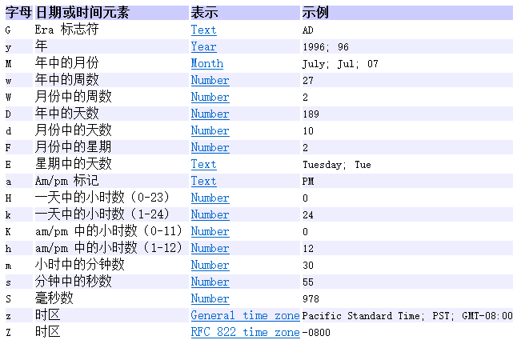
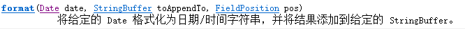

# Java.until.Date日期工具类和Java.text.DateFormat日期格式类

## 一、Java.until.Date日期工具类

1.以毫秒为单位计算时间的对象，时间起点（0毫秒）为1970年1月1日0：00。

```java
        //以当前系统时间创建Date对象
        Date date1 = new Date();
        //Wed Feb 10 22:32:40 CST 2021
        System.out.println(date1);

        //以1970.1.1 00:00时+60000000毫秒创建Date对象
        Date date2 = new Date(60000000);
        //Fri Jan 02 00:40:00 CST 1970
        System.out.println(date2);
        
        //getTime()返回Date对象相对1970.1.1 00:00的毫秒
        System.out.println(date2.getTime());//60000000
```

## 二、Java.text.DateFormat日期格式类

1.Java.text.DateFormat日期格式类是Java.text.Format格式化类的子抽象类。
2.作用：格式化（日期->文本）/解析（文本->日期）。

3.==由于DateFormat为抽象类故，多使用其子实现类Java.text.SimpleDateFormat类。==

## 三、Java.text.SimpleDateFormat类

1.SimpleDateFormat(String pattern)用给定的模式创建对象。

	

2.格式化：日期->文本

	

```java
        //创建SimpleDateFormat日期格式化对象
        SimpleDateFormat simpleDateFormat = new SimpleDateFormat("yyyy年MM月dd日");
        //以当前日期创建日期对象
        Date date = new Date();
        //使用格式化对象格式化日期对象返回字符串后打印输出
        System.out.println(simpleDateFormat.format(date));
		//控制台：2021年02月10日
```

3.解析：文本->日期

	

```java
        //创建SimpleDateFormat日期格式化对象
        SimpleDateFormat simpleDateFormat1 = new SimpleDateFormat("yyyy年MM月dd日");
        //字符串的格式必须与格式化对象格式一致，否则会报ParseException解析异常
        String dateStr = "1998年09月16日";
        //使用格式化对象解析字符串返回Date日期对象后打印输出
        System.out.println(simpleDateFormat.parse(dateStr));
		//控制台：Wed Sep 16 00:00:00 CST 1998
```