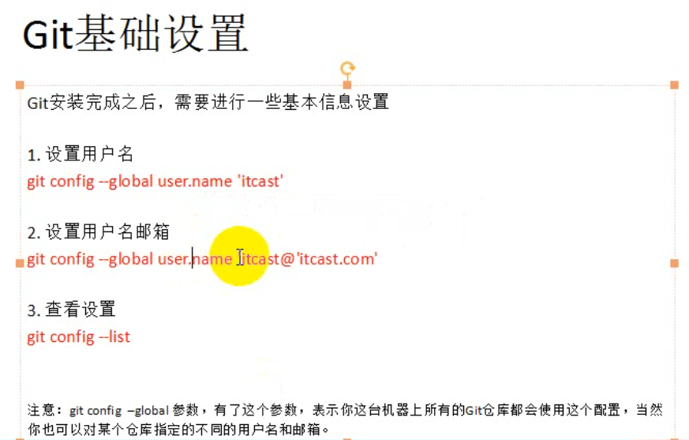
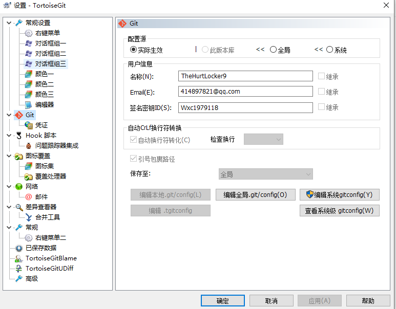
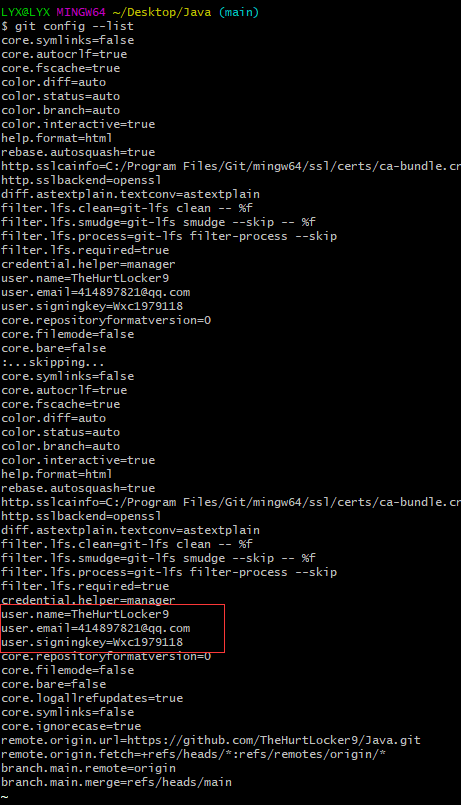
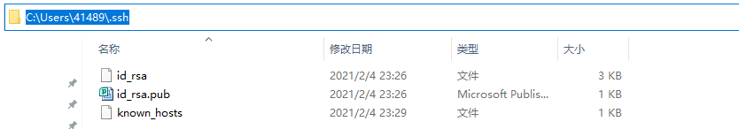
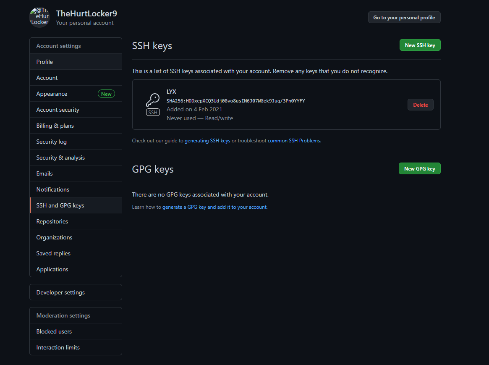
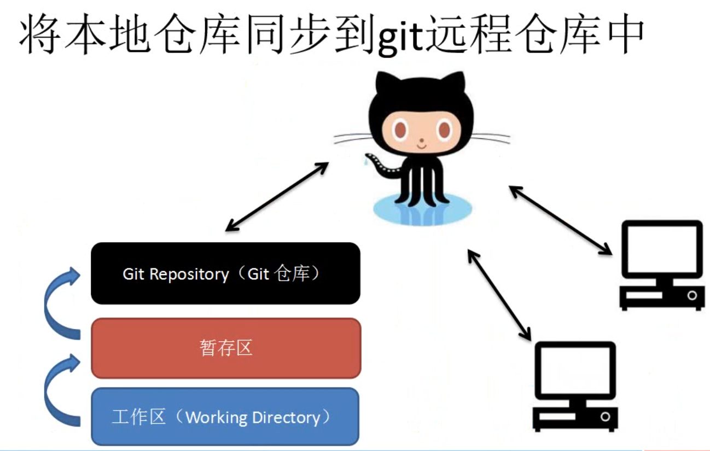
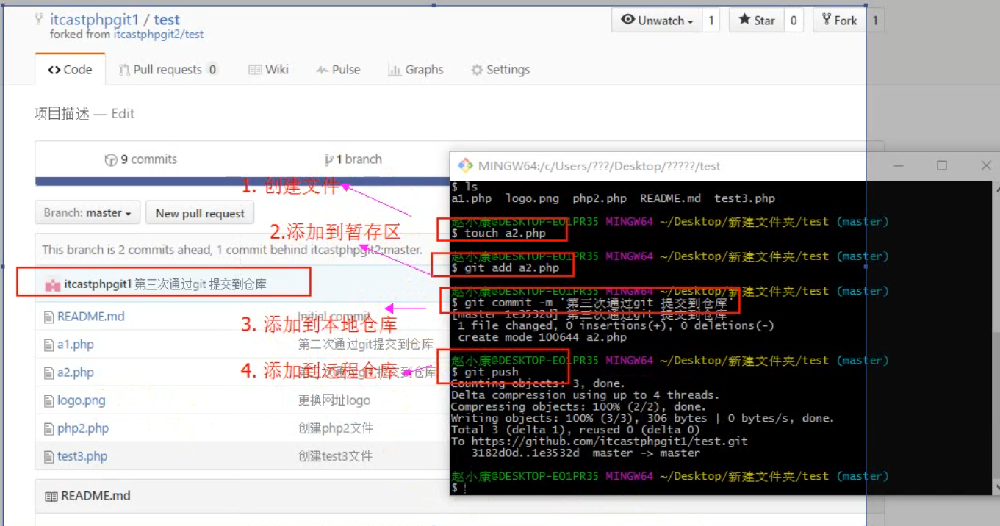

# 关于Git+TortoiseGit的配置和使用

## 一、Git+TortoiseGit的安装

1.TortoiseGit是基于git的图形化封装，具体功能实现仍需要通过安装Git来配合使用。

## 二、Git+TortoiseGit的配置

1.设置git的用户名和邮箱，如果需要连接GitHub，则尽量与GitHub账户名保持一致。

	

2.在TortoiseGit中设置用户名和邮箱，如果需要连接GitHub，则与GitHub账户信息保持一致。

	

3.使用git config --list查看git配置信息

	

## 三、Git与GitHub的连接配置

1.在本地生成SSH秘钥，复制id_rsa.pub文件中的SSH秘钥。

$ ssh-keygen -t rsa -C 414897821@qq.com

	

2.在GitHub中使用SSH进行配置。

## 四、使用

1.先在GitHub创建仓库，之后clone克隆到本地开始使用。

2.文件提交分为四层：本地工作区、暂存区(add)、本地仓库(commit)、远端仓库(push)。

（文件提交过程如下图）

## 五、参考文献

1.https://blog.csdn.net/winy_lm/article/details/80452590	git TortoiseGit 初次连接github 使用步骤

2.https://www.cnblogs.com/nsky/p/8847610.html	Tortoisegit和GitHub使用入门