# 数据结构

## 一、线性结构和非线性结构

### 1.线性结构

（1）常见的线性结构有：数组、队列、链表和栈。其特点是数据元素之间存在一对一的线性关系。

（2）线性结构中有两种不同的存储结构，即==顺序存储结构==和==链式存储结构==。

### 2.非线性结构

（1）非线性结构包括：二维数组、多维数组、广义表、树结构、图结构。


## 二、稀疏数组

### 1.基本介绍

（1）但一个数组中大部分元素为0，或者为同一值得数组时，可以使用稀疏数组来压缩保存该数组。

（2）稀疏数组的处理方法：稀疏数组第一行记录总行数、总列数和特殊值个数 ，从第二行开始记录原数组中特殊值的行标、列标和值。

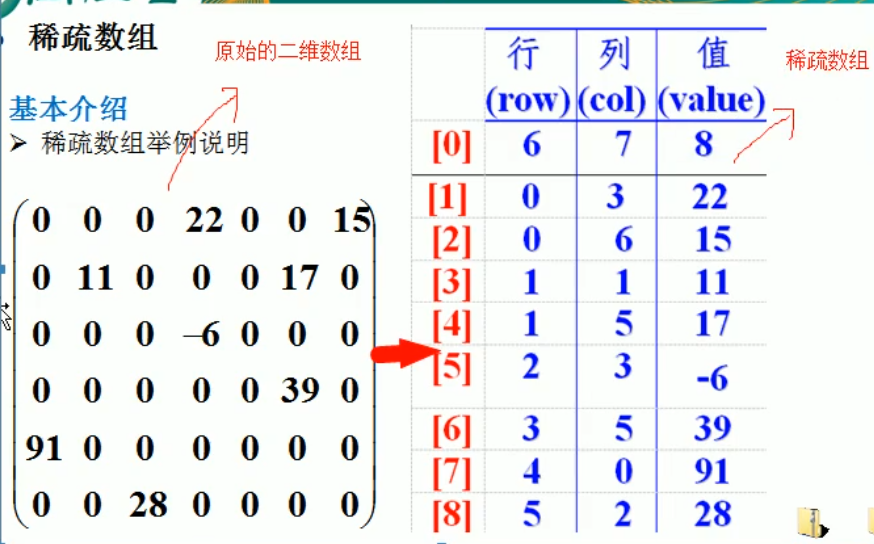	

### 2.应用思路

#### 2.1二维数组转稀疏数组的思路

（1）遍历原始二维数组，得到特殊值数据的个数sum。

（2）根据sum创建稀疏数组sparseArray int[sum+1] [3]。

（3）再次遍历，将二维数组的特殊值数据存入到稀疏数组。

#### 2.2稀疏数组转回二维数组的思路

（1）先读取稀疏数组的第一行，根据第一行的数据创建原始的空二维数组。

（2）再从第二行开始读取数据，并赋值给对应的原始二维数组即可。


## 三、表

### 1.顺序存储

（1）特点：以数组为容器，元素插入或删除需要连续移动大量元素。

（2）注意：在插入元素时需注意判断容器是否已满，及时扩容。扩容时需将原数组重新加入至新创建的增容数组中。

### 2.链式存储

#### 2.1单链表

（1）简介：头指针为空白节点，依靠指针单项链接。

（2）单链表的逆序：新建一个单链表，遍历 每次取原链表的第一个结点向新链表的头结点后插入。

```java
/**
     * 8.链表倒置
     */
    public void reverse() {
        //创建一个新的头结点
        Node reverseHead = new Node();
        //设置一个临时操作结点
        Node temp = head.getNextNode();
        while (temp != null) {
            //将操作结点从原链表中拆出
            head.setNextNode(temp.getNextNode());
            //向逆序链表中插入操作结点
            temp.setNextNode(reverseHead.getNextNode());
            reverseHead.setNextNode(temp);
            //操作结点后移
            temp = head.getNextNode();
        }
        //将倒序后的链表接入回原链表
        head.setNextNode(reverseHead.getNextNode());
    }
```

#### 2.2双向链表

双向链表弥补了单向链表的一些缺点：

（1）单向链表查找的方向只能是一个方向，而双向链表可以向前或向后。

（2）单向链表不能够自我删除，往往需要依靠前一个结点实现删除操作，而双向链表可以自我删除。

	

#### 2.3环形链表	

> **单向环形链表的构建**==（过程类似于环形队列）==

- 首先创建环形链表的第一个结点，并使用first（头指针）、rear（尾指针）指针指向该结点。

- 新建第二个结点，使node.next = first，rear.next = node。

- rear指针后移，以此类推插入新结点形成环形链表。

  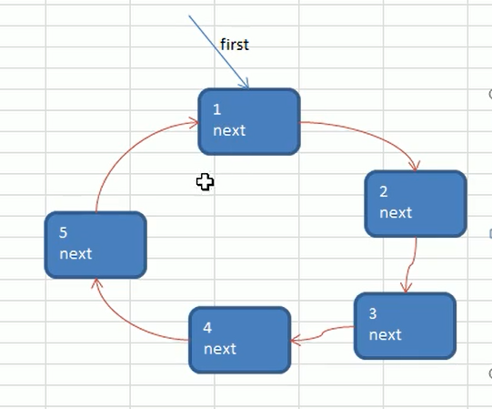	

- ```java
  public <E> void add(E e) {
      if (first==null){
          Node<E> head = new Node<>(e);
          //自己指向自己形成闭环
          head.setNextNode(head);
          first = head;
          rear = head;
          return;
      }
      //创建新结点
      Node<E> newNode = new Node<>(e);
      //新结点的后指针指向first头结点
      newNode.setNextNode(first);
      //尾结点的后指针指向新结点
      rear.setNextNode(newNode);
      //尾指针后移
      rear = rear.getNextNode();
  }
  ```

> **单向环形链表的遍历**

- 创建辅助指针指向first结点，并通过遍历不断后移指针实现。

- 当 辅助指针.next = first 时，表示单向环形链表的遍历完成。

- ```java
      public void printList() {
          Node<?> sub = first;
          System.out.println("--------------开始输出--------------");
          do {
              System.out.println(sub);
              sub = sub.getNextNode();
          } while (sub != first);
          System.out.println("--------------结束输出--------------");
      }
  ```

#### 2.4约瑟夫环问题（Josephu）

> **Josephu问题（约瑟夫环问题）既可以采用数组取模又可以使用单向环形链表完成。**

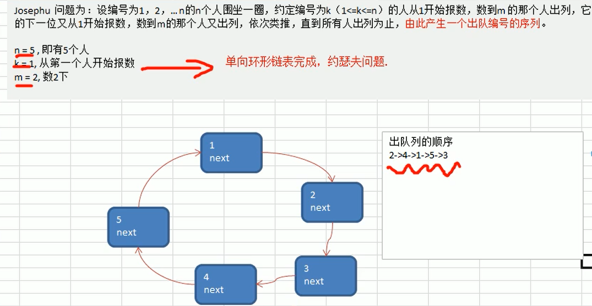	


- 完成出队需求时需要找到指定开始报数结点及其开始报数结点的前一节点（由于单向链表无法自我删除）。

- 开始向后报数，移动报数结点指针及其前结点指针m-1次

- 注意：由于单向链表特性，在寻找始报数结点时需要==单独对指定的开始报数结点是否为first头结点进行if判断==；如果为true，始报数前结点指针指向rear尾结点。

- ```java
  Node<?> sub = first.getNextNode();//遍历用临时结点指针
  Node<?> userNode = null;//指定的开始计数结点指针
  Node<?> userFrontNode = null;//指定的开始计数结点的前结点指针
  //判断指定结点是否是头结点
  if (sub.getData().equals(first.getData())){
      userNode =first;
      userFrontNode = rear;
  }
  //若不是头结点则找出该指定结点,从第二个结点开始遍历
  do {
      if (sub.getNextNode().getData().equals(data)){
          userNode = sub.getNextNode();
          userFrontNode = sub;
          break;
      }
      sub = sub.getNextNode();
  } while (sub != first);
  ```


## 四、队列

### 1.基本介绍

（1）队列是一个有序列表，可以用数组或链表的形式来实现。

（2）队列遵循先入先出的原则。

（3）通过队首指针front和队尾指针rear控制入队和出队。

（4）队列可采用链式和顺序两种存储方式。

### 2.普通队列

存在问题：普通队列不能复用，于是产生了环形队列。

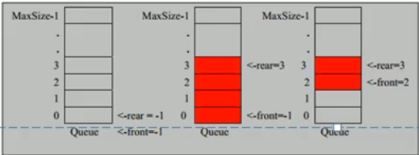	

### 3.环形队列

（1）环形队列==默认队尾空出一个存储单元==用作区分队满和队空。

（2）队满：(rear+1)%maxsize=front）

（3）队空：rear = front

（3）队列中数据元素的个数（rear-front+maxsize）%maxsize

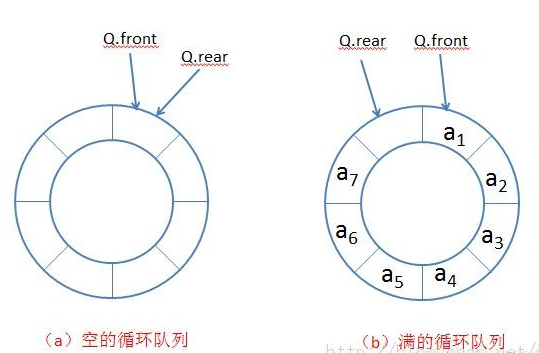		


## 五、栈（stack）

### 1.基本介绍

- 栈是一个先入后出的有序列表。

- 栈是限制线性表中元素的插入和删除只能在线性表的同一端进行的一种特殊线性表。允许插入和删除的一端为栈顶（Top），另一端为固定的一端，称为栈底（Bottom）。

- 出栈（pop）和入栈（push）的概念：

  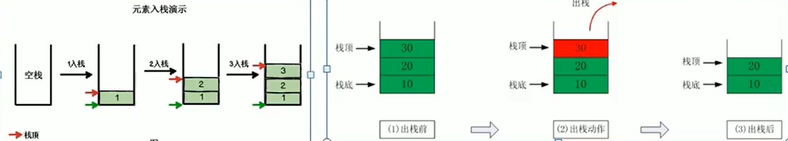

### 2.顺序结构

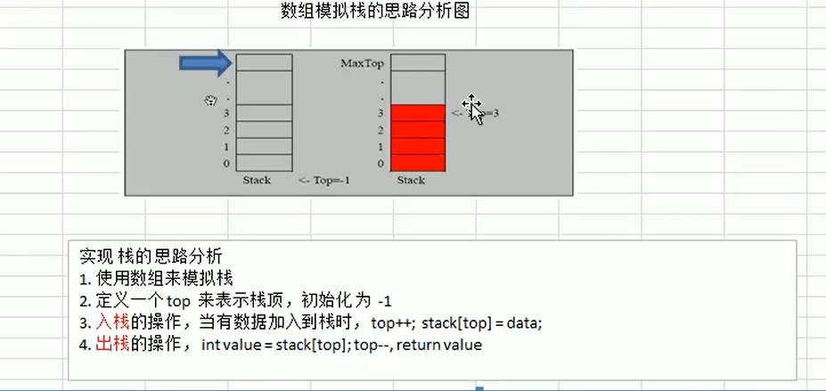	

- 入栈注意判断扩容
- 出栈注意判断栈空

### 3.链式结构

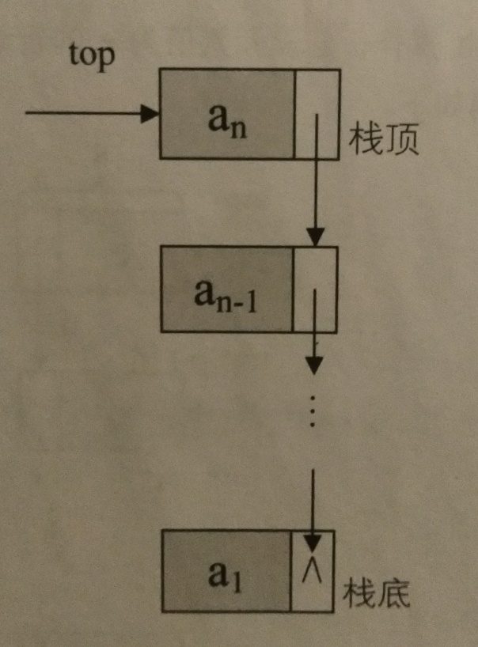	

- 栈的链式结构top栈顶指针指向链表的第一个结点，即是将单链表的第一个结点作为top栈顶，最后一个结点作为bottom栈底。
- 入栈即是在单链表的第一个结点前插入新结点，top指针上移指向新插入的结点。
- 出栈即是将单链表的第一个结点删除，top指针下移指向新的栈顶结点。

### 4.栈的应用——计算器原理

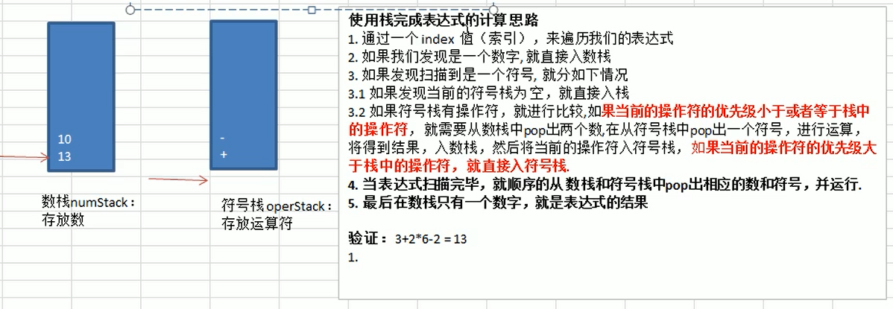	

`详细代码见：GitHub->Java->StackCalculator项目模块`

### 5.前缀、中缀、后缀表达式

> **前缀表达式（波兰表达式）**

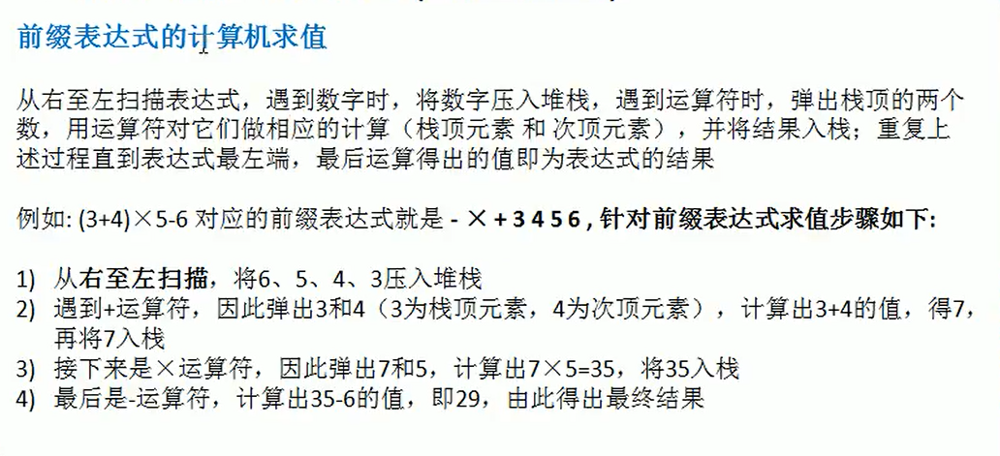	

> **中缀表达式（日常运算中的算式）**

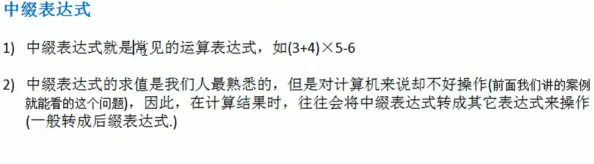	

> **后缀表达式（逆波兰表达式）**

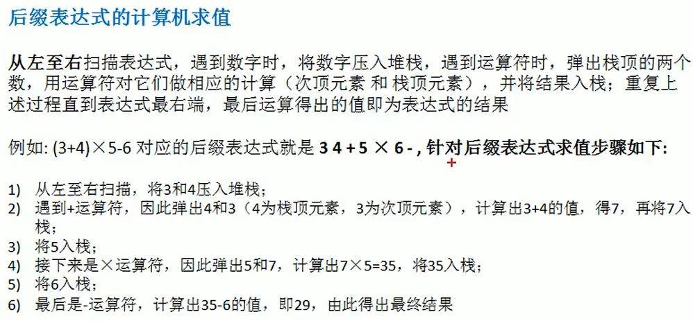	


## 六、递归算法

递归递归，有递就要有归。

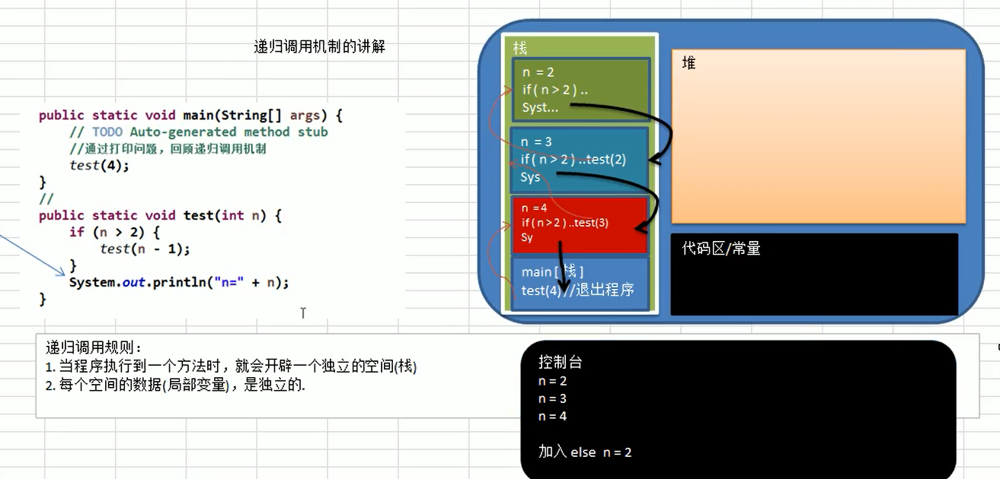	

### 1.递归需要遵守的规则

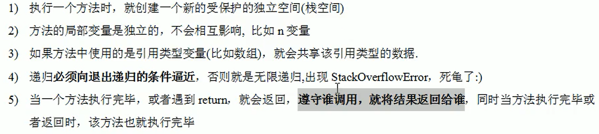	

### 2.迷宫问题

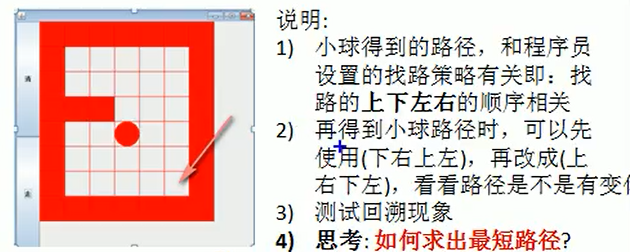	

```java
//终点为game[6][6]
//上-左-下-右 不同的寻路顺序会有不同的结果
//0-未走  1-墙  2-已走  3-死路
private static boolean setWay(int[][] game, int x, int y) {
    if (game[6][6] == 2) {
        return true;
    } else {
        if (game[x][y] == 0) {//如果该点未被阻断
            game[x][y] = 2;
            if (setWay(game, x - 1, y)) {//上探路
                return true;
            } else if (setWay(game, x, y - 1)) {//左探路
                return true;
            } else if (setWay(game, x + 1, y)) {//下探路
                return true;
            } else if (setWay(game, x, y + 1)) {//右探路
                return true;
            } else {
                game[x][y] = 3;//上下左右均不通，设置为死路
                return false;
            }
        }else {
            return false;
        }
    }
}
```

### 3.八皇后问题

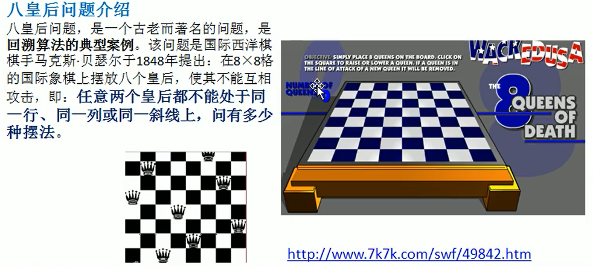	

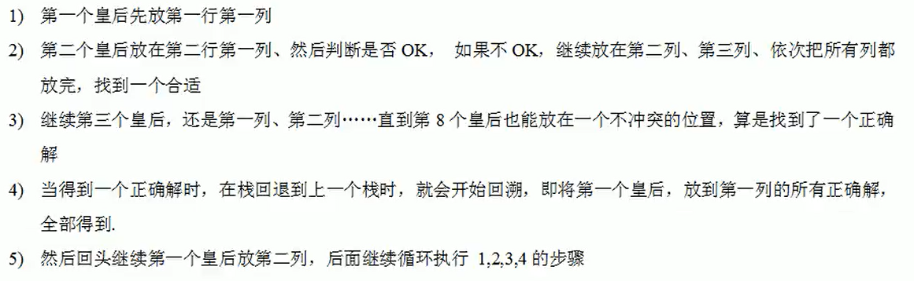	

## 七、时间复杂度

### 1.时间频度f(n)

一个算法中的**`语句执行次数`**称为语句频度或时间频度。

### 2.时间复杂度T(n) = O(f(n))

判断一个算法的效率时，函数中的**`常数项`**和其他**`次要项（非最高次幂项）`**及**`主项（最高次幂项）的系数`**常常可以忽略，决定效率的往往是**==最高次项的阶数==**。

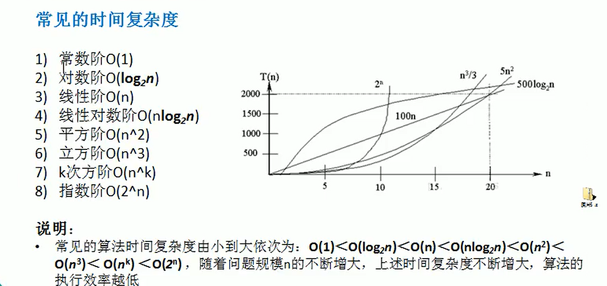	

> **时间复杂度计算方法**

- 用常数1代替f(n)中的所有加法常数项。
- 去除次要项，只保留最高阶项。
- 去除最高阶项的系数。

### 3.最坏情况与平均情况

如从n个数字中查找一个数字，那么最好的情况是时间复杂度为O(1)，最坏情况的时间复杂度是O(n)，而平均运行时间情况则为2/n次。

## 八、树

### 1.树形结构存在的意义

- 在**线性结构**中，数据元素存在一对一的关系，无论是顺序存储或是链式存储在插入或检索时均存在一定的**效率不足**。
- 在**树形结构**中，数据元素有一对多的关系，在数据的存储、读取和检索的速度都可以**得到一定的保证。**

### 2.树的定义

- 树是n>=0的结点有限集合，n=0时为空树，n>0时根结点是唯一的。

- ==结点拥有子结点的数量称为度==，叶结点（终端结点）的度为0，度不为0的结点为分支结点（非终端结点）。

  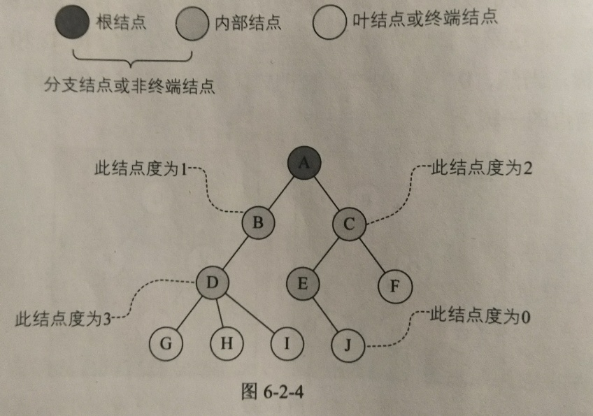	

- 一个结点的子结点==称为该结点的孩子==，相对应的，该结点==称为孩子的双亲==。

  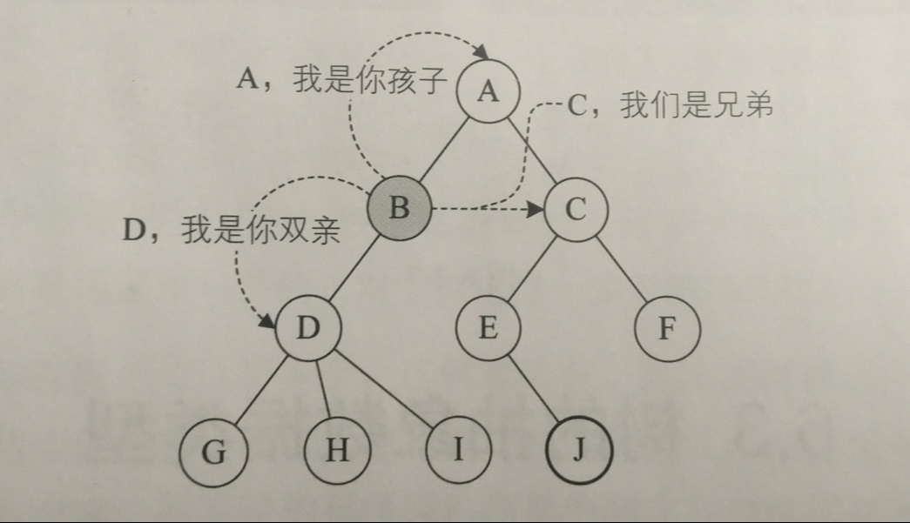	

- 树中结点的最大层次称为树的深度或高度。

  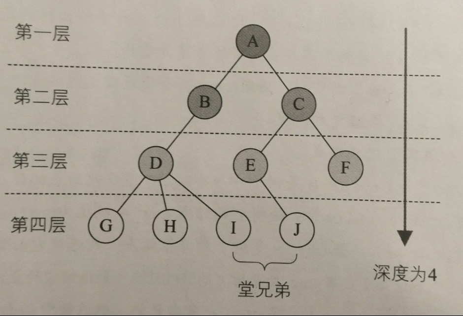	


### 3.树的存储结构

> **（1）双亲表示法**

在数组结构中存储**结点数据**和**双亲位置的数组索引**，通过定位结点双亲的位置读取树的结构。

缺点：如果想获取一个结点的子结点，需要遍历整个树结构。

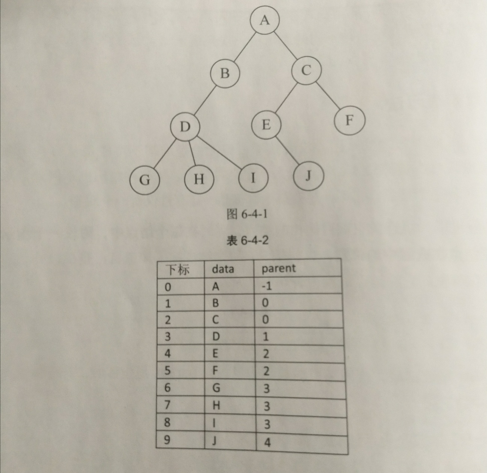	


> **（2）双亲孩子表示法**

在双亲表示法的基础上增加了用于查找==子结点的单链表==。

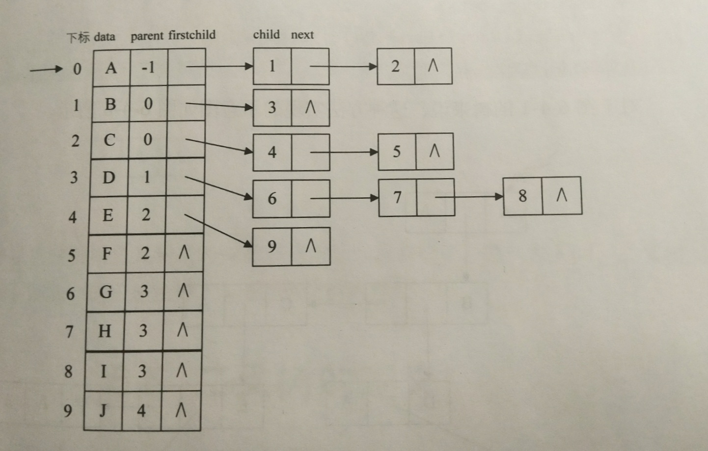	


> **（3）孩子兄弟表示法**

通过存储**数据域**、**长子结点指针域**、**右兄弟指针域**来实现树的结构。==孩子兄弟表示法与二叉树的左右子结点表示法存储结构一致，但指针域认知不同（长子结点指针域=左子结点指针域，右兄弟指针域=右子结点指针域）==，因此存在树与二叉树的相互转换问题。

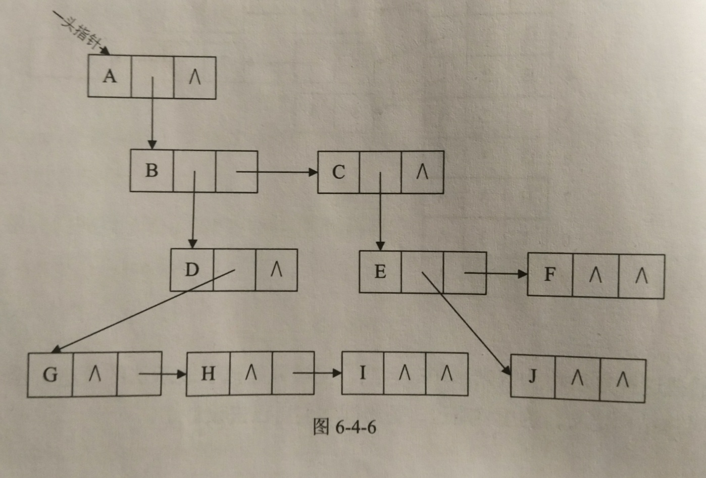	


## 九、二叉树

### 1.二叉树的定义

- 二叉树每个结点最多有两个子结点，所以二叉树中不存在度大于2的结点。
- 左右子树的次序不可交换。
- 即使某结点只有一颗子树也要区分是左子树还是右子树。

### 2.特殊二叉树

> **（1）斜树**

一棵二叉树中所有结点都只有左子结点称为左斜树，或都只有右结点称为右斜树。

> **（2）满二叉树**

- 非叶子结点的度一定是2。

- 叶子结点只能出现在最下一层。

  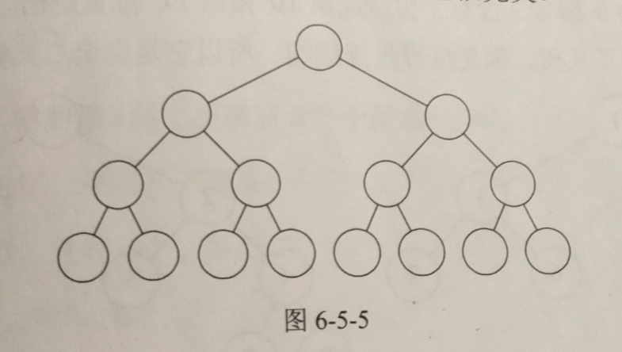	

> **（3）完全二叉树**

如果二叉树中的编号顺序与满二叉树中的顺序一致，则该二叉树为完全二叉树。（下图均为非完全二叉树）

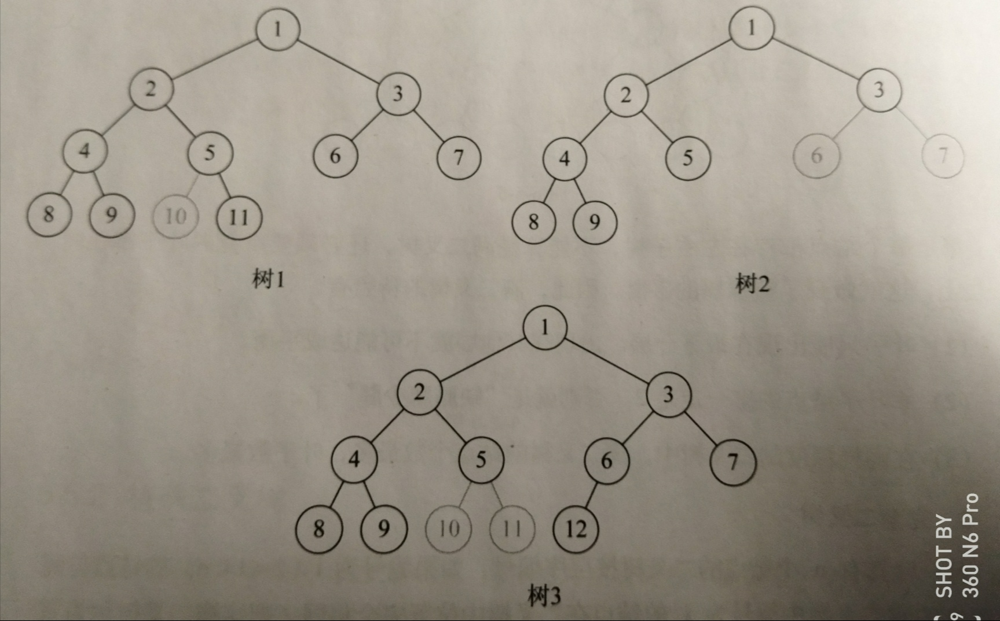	

### 3.二叉树的性质☆

> **性质1：在二叉树的第i层上至多有2^i-1^个结点**

> **性质2：深度为k的二叉树至多有2^k^-1个结点**

> **性质3：对于任何一棵二叉树，叶子结点个数 = 满结点（度为2）个数+1**

> **性质4：具有n个结点的完全二叉树，==其深度为[log~2~n]向下取整+1==**

> **性质5：在完全二叉树中（1<=i<=n），==i结点的双亲为[2i]向下取整==，如果2i>n或2i+1>n则i结点无左子结点或右子结点**

### 4.二叉树的存储结构


### 5.二叉树的遍历

> **（1）前序遍历**

==先输出父结点==，再遍历左子树和右子树。

```java
private void preOrder(Node node) {
    if (node == null) {
        return;
    }
    System.out.print(node.getData() + " ");
    preOrder(node.getLeftNode());
    preOrder(node.getRightNode());
}
```

> **（2）中序遍历**

先遍历左子树，==再输出父结点==，最后遍历右子树。

```java
private void inOrder(Node node) {
    if (node == null) {
        return;
    }
    inOrder(node.getLeftNode());
    System.out.print(node.getData() + " ");
    inOrder(node.getRightNode());
}
```

> **（3）后序遍历**

先遍历左子树，再遍历右子树，==最后输出父结点==。

```java
private void postOrder(Node node) {
    if (node == null) {
        return;
    }
    postOrder(node.getLeftNode());
    postOrder(node.getRightNode());
    System.out.print(node.getData() + " ");
}
```

> **（4）层序遍历**

从上而下逐层遍历，在同一层中从左至右顺序输出。

### 6二叉树的推导

即前序遍历、中序遍历、后序遍历知二求一，但需注意：

- 已知前序遍历和中序遍历，可以确定后序遍历。
- 已知中序遍历和后序遍历，可以确定前序遍历。
- **但已知前序遍历和后序遍历，==不==可确定中序遍历。**

> 方法总结：

- 已知前序遍历和后序遍历可知各分割段根结点。
- 已知各分割段根结点后，可根据中序遍历确定左右子结点或再次根据左右子树分割遍历段。

### 7.二叉树的扩展先序递归创建

```java
private Node creatNode() {
    char c = userIn.charAt(index++);//读取数据
    if (c == '#') {
        return null;
    } else {
        Node node = new Node();//创建结点
        node.setData(c);//设置结点数据
        node.setLeftNode(creatNode());//设置左子树
        node.setRightNode(creatNode());//设置右子树
        return node;
    }
}
```

### 8.二叉树的查找

> **（1）先序查找** 

```java
    /**
     * 先序查找结点
     *
     * @param c    结点数据
     * @param node 查找的结点
     * @return 找到则返回该结点，否则返回null
     */
    private Node preFind(char c, Node node) {
        count++;
        if (node.getData().equals(c)) {
            return node;
        }
        Node n = null;
        if (node.getLeftNode() != null) {
            n = preFind(c, node.getLeftNode());
            if (n != null) {
                return n;
            }
        }
        if (node.getRightNode() != null) {
            n = preFind(c, node.getRightNode());
            if (n != null) {
                return n;
            }
        }
        return n;
    }
```

> **（2）中序查找**

```java
    /**
     * 中序查找结点
     *
     * @param c    结点数据
     * @param node  查找的结点
     * @return 找到则返回该结点，否则返回null
     */
    private Node inFind(char c, Node node) {
        Node n = null;
        if (node.getLeftNode() != null) {
            n = preFind(c, node.getLeftNode());
            if (n != null) {
                return n;
            }
        }
        count++;
        if (node.getData().equals(c)) {
            return node;
        }
        if (node.getRightNode() != null) {
            n = preFind(c, node.getRightNode());
            if (n != null) {
                return n;
            }
        }
        return n;
    }
```

> **（3）后序查找**   ==查找次数最少==

```java
    /**
     * 后序查找结点
     *
     * @param c    结点数据
     * @param node  查找的结点
     * @return 找到则返回该结点，否则返回null
     */
    private Node postFind(char c, Node node) {
        Node n = null;
        if (node.getLeftNode() != null) {
            n = preFind(c, node.getLeftNode());
            if (n != null) {
                return n;
            }
        }
        if (node.getRightNode() != null) {
            n = preFind(c, node.getRightNode());
            if (n != null) {
                return n;
            }
        }
        count++;
        if (node.getData().equals(c)) {
            return node;
        }
        return n;
    }


    public int getCount() {
        return count;
    }
```