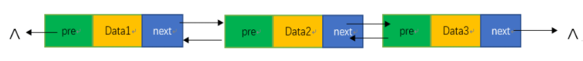

# 数据结构

## 一、线性结构和非线性结构

### 1.线性结构

（1）常见的线性结构有：数组、队列、链表和栈。其特点是数据元素之间存在一对一的线性关系。

（2）线性结构中有两种不同的存储结构，即==顺序存储结构==和==链式存储结构==。

### 2.非线性结构

（1）非线性结构包括：二维数组、多维数组、广义表、树结构、图结构。

## 二、稀疏数组

### 1.基本介绍

（1）但一个数组中大部分元素为0，或者为同一值得数组时，可以使用稀疏数组来压缩保存该数组。

（2）稀疏数组的处理方法：稀疏数组第一行记录总行数、总列数和特殊值个数 ，从第二行开始记录原数组中特殊值的行标、列标和值。

	

### 2.应用思路

#### 2.1二维数组转稀疏数组的思路

（1）遍历原始二维数组，得到特殊值数据的个数sum。

（2）根据sum创建稀疏数组sparseArray int[sum+1] [3]。

（3）再次遍历，将二维数组的特殊值数据存入到稀疏数组。

#### 2.2稀疏数组转回二维数组的思路

（1）先读取稀疏数组的第一行，根据第一行的数据创建原始的空二维数组。

（2）再从第二行开始读取数据，并赋值给对应的原始二维数组即可。

## 三、表

### 1.顺序存储

（1）特点：以数组为容器，元素插入或删除需要连续移动大量元素。

（2）注意：在插入元素时需注意判断容器是否已满，及时扩容。扩容时需将原数组重新加入至新创建的增容数组中。

### 2.链式存储

#### 2.1单链表

（1）简介：头指针为空白节点，依靠指针单项链接。

（2）单链表的逆序：新建一个单链表，遍历 每次取原链表的第一个结点向新链表的头结点后插入。

```java
/**
     * 8.链表倒置
     */
    public void reverse() {
        //创建一个新的头结点
        Node reverseHead = new Node();
        //设置一个临时操作结点
        Node temp = head.getNextNode();
        while (temp != null) {
            //将操作结点从原链表中拆出
            head.setNextNode(temp.getNextNode());
            //向逆序链表中插入操作结点
            temp.setNextNode(reverseHead.getNextNode());
            reverseHead.setNextNode(temp);
            //操作结点后移
            temp = head.getNextNode();
        }
        //将倒序后的链表接入回原链表
        head.setNextNode(reverseHead.getNextNode());
    }
```

#### 2.2双向链表

双向链表弥补了单向链表的一些缺点：

（1）单向链表查找的方向只能是一个方向，而双向链表可以向前或向后。

（2）单向链表不能够自我删除，往往需要依靠前一个结点实现删除操作，而双向链表可以自我删除。

	

#### 2.3环形链表


## 四、队列

### 1.基本介绍

（1）队列是一个有序列表，可以用数组或链表的形式来实现。

（2）队列遵循先入先出的原则。

（3）通过队首指针front和队尾指针rear控制入队和出队。

（4）队列可采用链式和顺序两种存储方式。

### 2.普通队列

存在问题：普通队列不能复用，于是产生了环形队列。

	

### 3.环形队列

（1）环形队列==默认队尾空出一个存储单元==用作区分队满和队空。

（2）队满：(rear+1)%maxsize=front）

（3）队空：rear = front

（3）队列中数据元素的个数（rear-front+maxsize）%maxsize

		